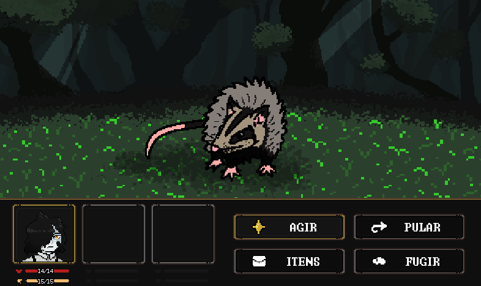
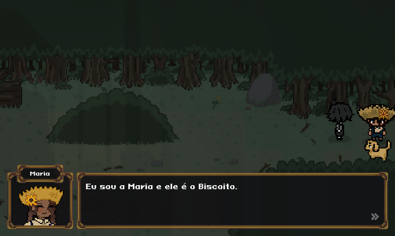
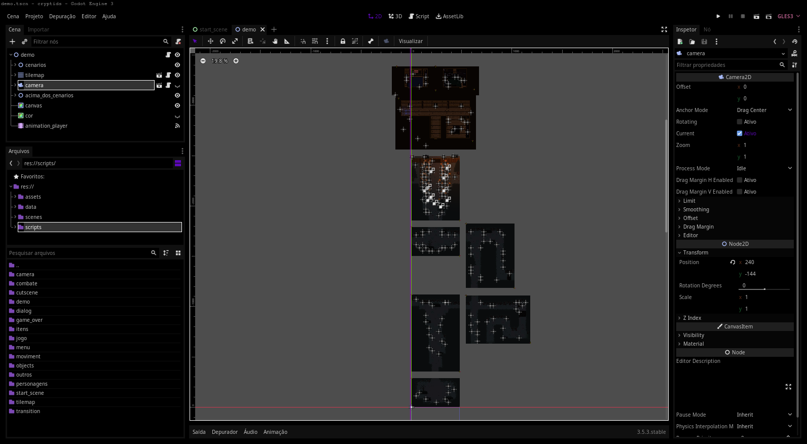

# CRYPTIDS

## Introdução

Este é um repositório do Trabalho de Conclusão de Curso (TCC), de alunos que cursavam Técnico de Informática no CEFET-MG campus V em tempo integral. "Cryptids" é um jogo RPG que se passa no tempo do Brasil imperial. Desenvolvido no Godot, uma game engine grátis de código aberto.

## Descrição do Jogo

Cryptids é um jogo eletrônico RPG, onde o jogador se encontra em um mundo totalmente desconhecido e rico em novas interpretações sobre a história do Brasil Imperial. Nosso protagonista será constantemente desafiado por quebra-cabeças e combates de turnos. O visual 2D pixelado, junto com a paleta de cores, irá trazer um sentimento de desconforto, deixando o usuário cada vez mais imerso nesse universo.

## Funcionalidades Principais

- **Narrativa Profunda:** Uma história envolvente com reviravoltas inesperadas e temas psicológicos profundos.
- **Exploração:** Um mundo rico e detalhado para explorar, com segredos a serem descobertos a cada canto.
- **Batalhas Estratégicas:** Combates baseados em turnos que desafiam a estratégia do jogador e oferecem uma variedade de habilidades e táticas.
- **Quebra-Cabeças Desafiadores:** Desvende quebra-cabeças inteligentes que testarão sua lógica e criatividade.
- **Contexto histórico:** Vários acontecimentos histŕicos desta época serão representatos e terão um grande peso para história do jogo.

## Capturas de Tela

## Como Jogar

1. *Baixe o jogo*:

	- https://mthlssn.github.io/cryptids-site/

2. *Inicie o jogo*:

   - Abrar o arquivo executável. 

3. *Controles*:

   - Utilize as teclas AWSD para mover o personagem e navegar pelo menu.
   - Pressione a barra de ESPAÇO para interagir com objetos e selecionar opções no menu.

## Recursos Utilizados

- *Godot Engine*: Versão 3.5.3 LTS
- *GDScript*: A linguagem de script usada no Godot para o desenvolvimento do jogo.

## Licença

Este projeto é licenciado sob a Licença MIT - veja o arquivo [LICENSE](LICENSE) para mais detalhes.
